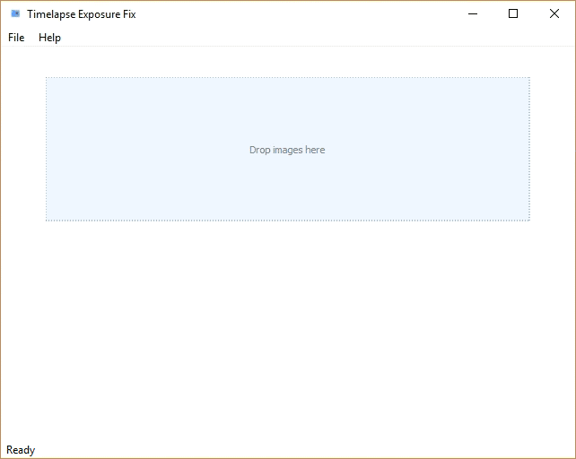

# Time-lapse exposure fixing tool
Time-lapse photography is a popular technique taking a sequence of frames at set intervals to record changes that take place in a scene over time. This photographic technique is popularly used nowadays, especially on video-sharing websites such as YouTube. This simple tool is an idea (and excuse) of mine to get familiar with Qt for graphical user interfaces as well as OpenCV for image processing.

Common problems in time-lapse photography arise from exposure changes in the camera settings or even natural light changes in a scene. This tool's goal is to fix exposure changes in time-lapse videos, which are formed from a sequence of photographs.

Note: this tool can also be used for stop-motion animations to fix changing light in the scene.

Quick description of common problems in time-lapse shooting:
http://www.learntimelapse.com/time-lapse-exposure-avoiding-flicker-and-dragging-shutter/

## Usage

When the application is ready, select the sequence of images you wish to process from your folder, drag and drop them in the specified area, and see the results.

**Note: no task parallelism is currently implemented, which means that 
the current UI will block when processing images. This simple project 
was intended as an introductory project to PyQt.**

## TO-DO
* Task parallelism so as to not block the GUI when processing images
* Improve graphical user interface experience
